# manual-HTTP-Angel-DB-Pablo-BL

## Peticiones ThunderClient

### GET

Se introduce la direccion de nuestra API local en dirección a 'students'.
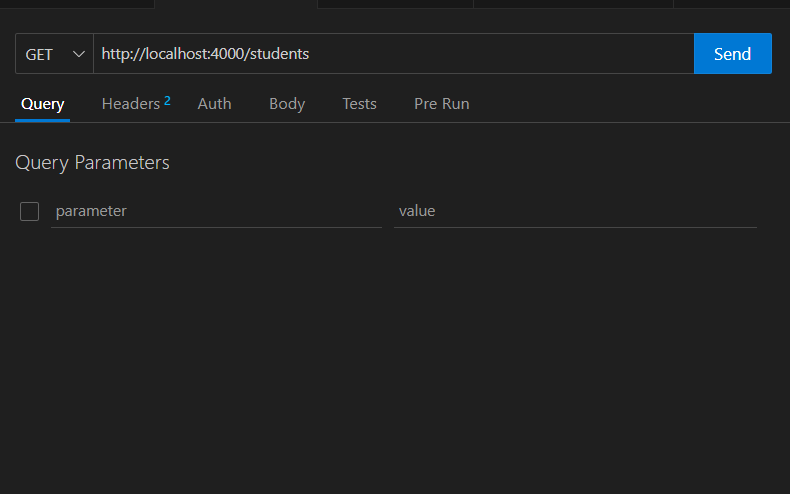

Resultado:

---

### GET ID

Se introduce la dirección con el siguiente parámetro que apunta al student con id=1
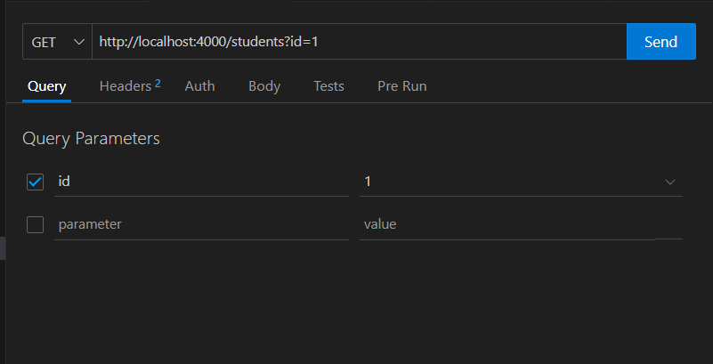

El resultado es que nos muestre únicamente ese student:
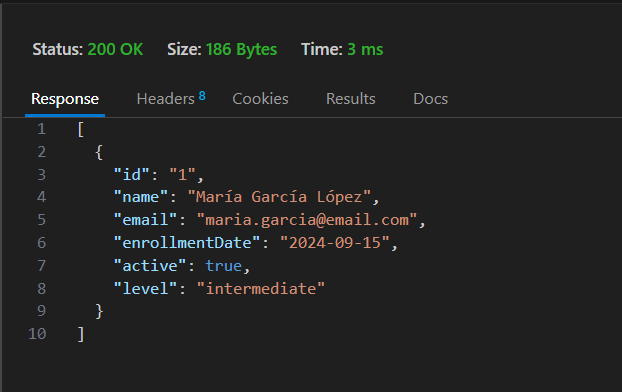

---

### POST

Introducimos en el body el student que vamos a postear en nuestra API.

Introducimos también el header 'Content-Type: application/json', esto es para aclarar que lo que introducimos en el body se escribe en lenguaje JSON.
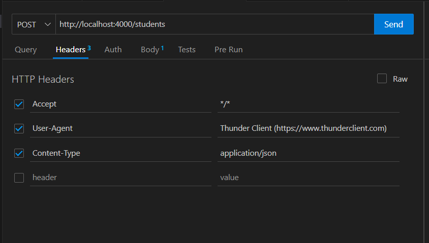

Resultado:
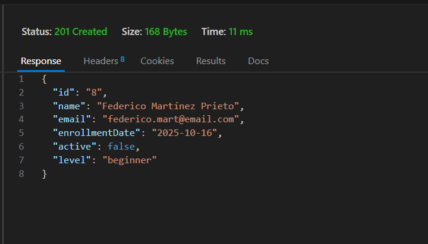

---

### PUT

Introducimos todos los valores que queramos cambiar de un student.
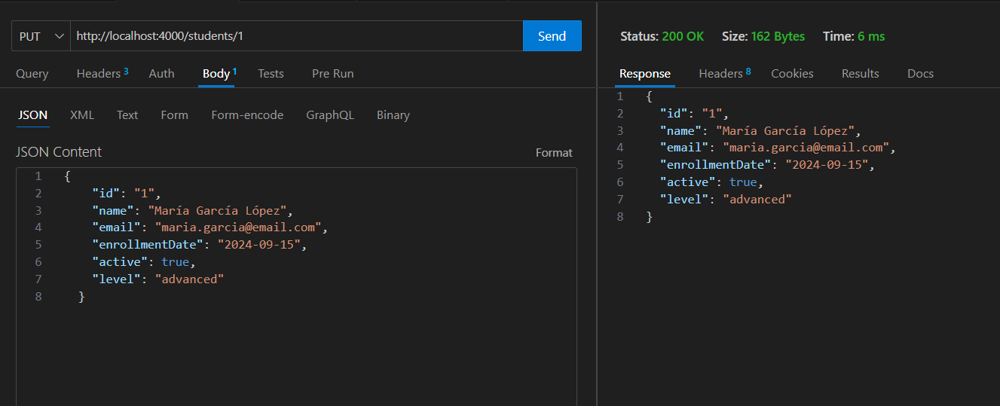

Importante el header.
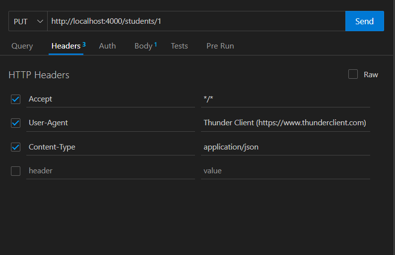

---

### PATCH

Introducimos el único campo que queramos cambiar.
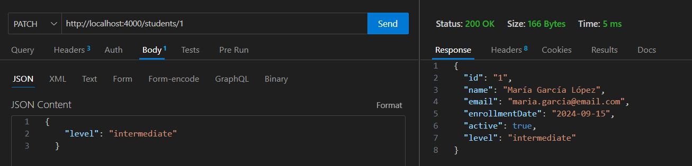

Con su correspondiente header
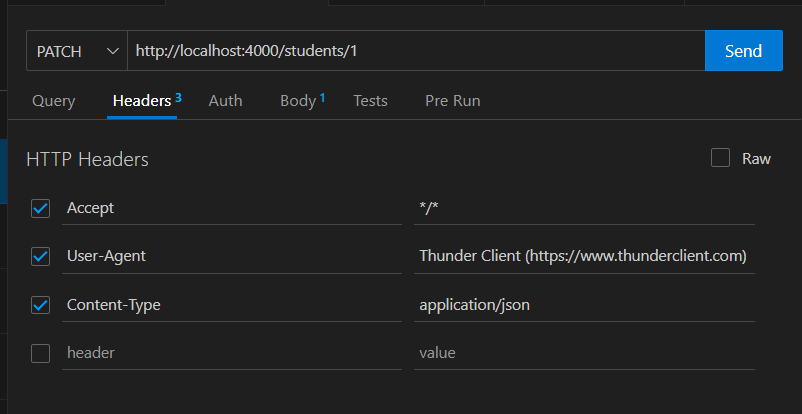

---

### DELETE

Introducimos la URL apuntando al student que queremos eliminar.
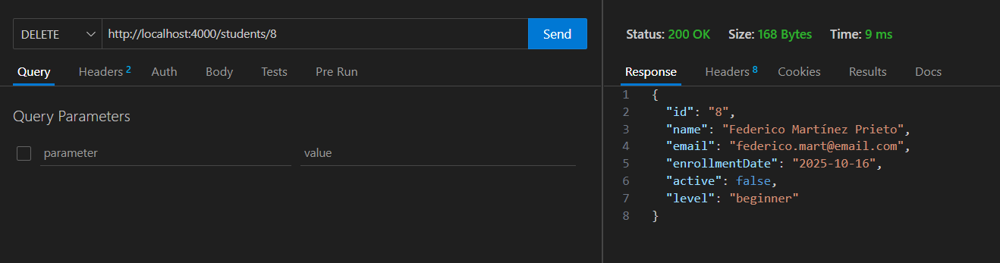

Podemos comprobar que tras hacer el request no se encuentra el student puesto que ha sido eliminado.
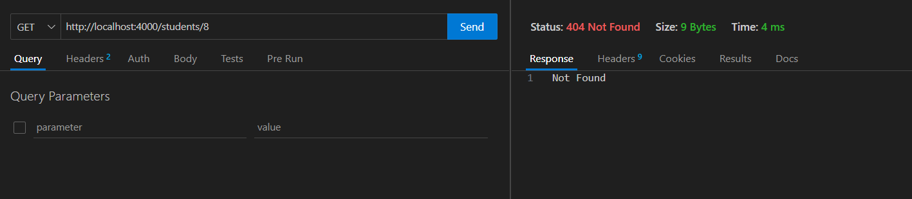

## Peticiones RestClient

### POST

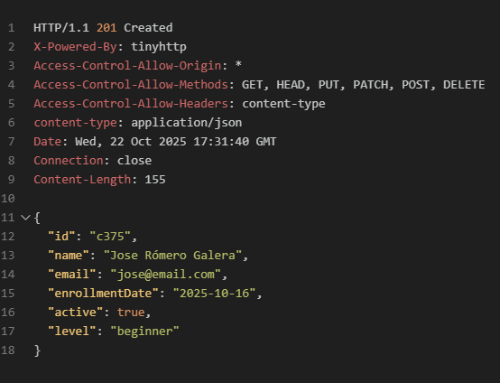

---

### GET 

---

### GET ID

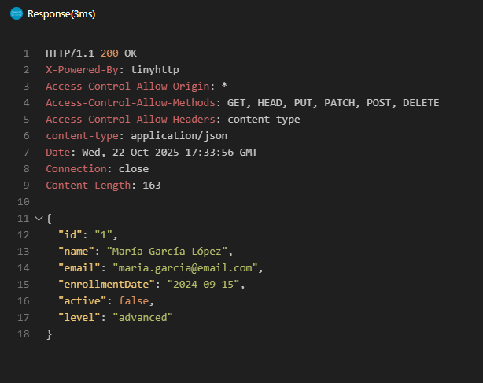

---

### GET FILTRADO POR ACTIVE=TRUE

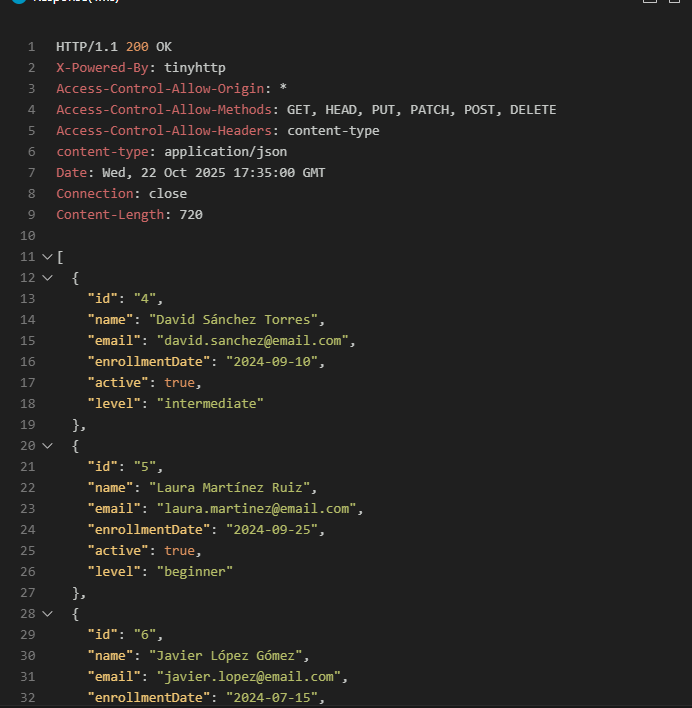

---

### GET FILTRADO POR LEVEL=INTERMEDIATE

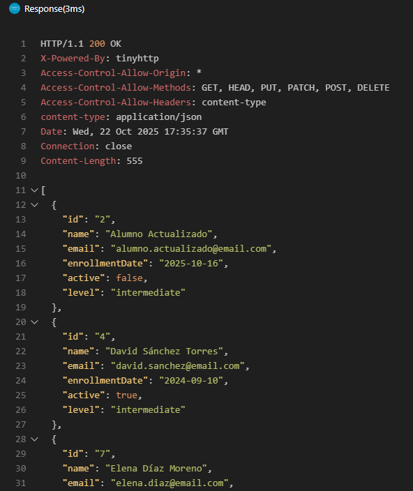

---

### PUT

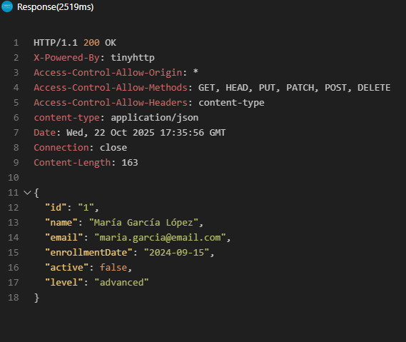

---

### PATCH

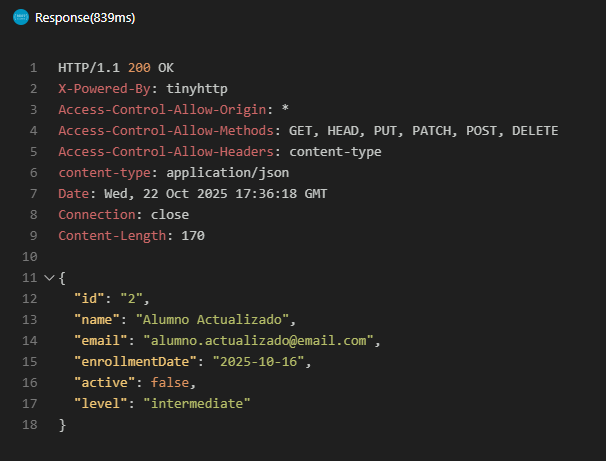

---

### DELETE

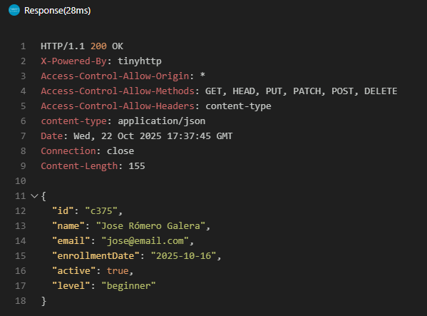
